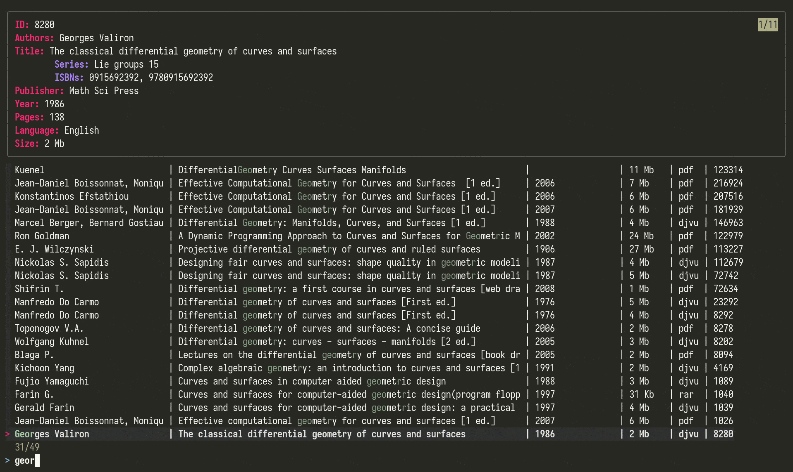

# genesisfzf

**Library Genesis TUI** using **fzf**.  
Using this, you can search the library genesis site, filter your book out using `fzf` as well as download the selected book by just pressing `Return`; everything right from your terminal!

## Usage
`libg search terms`  
For e.g.  
`libg curves and surfaces`.   
Or just entering `libg` brings up a `Enter searchterm:` prompt where you can enter search terms.
 
To change the number of pages to be scraped, change the `DEPTH` variable to whatever you want.  
Similarly, change `SORT`, `SORTMODE`, `SEARCHBY` and `RESPERPAGE` variables to change other settings. These with all its possible values are listed in the top few lines.  

## Installation
Since it is just a small shell script, just download the script, give it executable permissions and place it in a directory that is in `PATH`.
 
## Dependency
The only dependency is `fzf`: https://github.com/junegunn/fzf.   
The other dependencies are `sed`(GNU), `awk`, `curl` and `wget` but are present by default in most Linux installs. 

## Todos
1. Add command line options for changing `SORT`, `SORTMODE`, `DEPTH`, `SEARCHBY` and `RESPERPAGE` variables.
2. Add option for selecting different mirrors.
